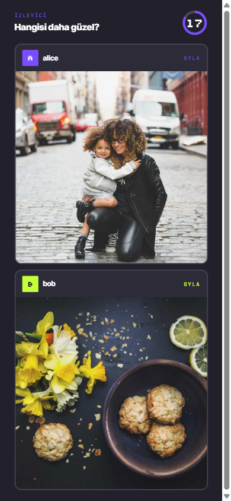

# ⚔️ Prompt Clash

**Telefonunla katıl, prompt yaz, AI'a çizdir, kazanan sen ol.**

Etkinlikler için tasarlanmış, QR ile katılımlı **1v1 AI görsel üretme yarışması**. İki oyuncu aynı temayı alır, en iyi prompt'u yazmaya çalışır, AI görselleri üretir ve kazanan ya AI puanıyla ya da izleyici oylamasıyla belli olur. Hepsi büyük ekranda canlı akar.

<p align="center">
  
</p>

---

## 🎮 Nasıl çalışıyor?

Üç ekran var: **telefon** (oyuncu + izleyici), **sahne** (TV/projeksiyon) ve **admin**.

| 1. Katıl | 2. Üret | 3. Oyla |
|:---:|:---:|:---:|
|  |  |  |
| QR'ı tara, takma adını gir, maça gir. | 60 saniyede prompt yaz — AI ikisini de çizer. | Berabere kalınca izleyici karar verir. |

Sonunda kazanan sahnede ilan edilir:

<p align="center">
  
</p>

**Akış:** `VS` → 60sn prompt → AI görsel üretimi → AI skoru *(berabere ise izleyici oylaması)* → kazanan → tekrar başa.

---

## ⚡ Hızlı başlangıç

```bash
# 1. Ortam değişkenleri
cp .env.example .env      # MONGODB_URI, GEMINI_API_KEY, GCS_BUCKET, ADMIN_PASSWORD'u doldur

# 2. Kur ve çalıştır
npm install
npm run dev
```

Sonra:

| Adres | Ne için |
|---|---|
| `localhost:3000` | 📱 Telefon — katıl / izle |
| `localhost:3000/stage` | 📺 Sahne — TV / projeksiyon |
| `localhost:3000/admin` | 🛠️ Admin — ayarlar & kontrol |

**Gerekenler:** Node.js 20+, MongoDB Atlas (M0 free yeter), Google Cloud Storage bucket ve bir [Gemini API key](https://aistudio.google.com).

---

## 🧱 Mimari

- **Tek Node.js süreci** — Next.js (App Router) + Socket.io aynı portta (`server.js`)
- **Tek global maç** — oda yok, durum RAM'de singleton olarak tutulur
- **MongoDB** — sadece ayarlar, maç geçmişi ve oy denetimi için
- **Görseller** GCS'te tutulur, public URL ile servis edilir
- **Gemini** hem görsel üretir (`gemini-2.5-flash-image`) hem skorlar (`gemini-2.5-flash` vision)

---

## ☁️ Cloud Run'a deploy

Tek instance, session affinity ve CPU throttling kapalı (canlı socket için şart):

```bash
gcloud run deploy prompt-clash \
  --image europe-west1-docker.pkg.dev/$PROJECT/prompt-clash/app:latest \
  --region europe-west1 --platform managed --allow-unauthenticated \
  --min-instances=1 --max-instances=1 \
  --session-affinity --cpu-throttling=disabled \
  --port=3000 --memory=1Gi \
  --set-env-vars NEXT_PUBLIC_APP_URL=https://your-domain.example,GCS_BUCKET=prompt-clash-images \
  --set-secrets MONGODB_URI=mongodb-uri:latest,GEMINI_API_KEY=gemini-key:latest,ADMIN_PASSWORD=admin-password:latest,ADMIN_COOKIE_SECRET=admin-cookie-secret:latest,GCS_SA_KEY_JSON=gcs-sa-key:latest
```

---

## 🛠️ Komutlar

| Komut | Açıklama |
|---|---|
| `npm run dev` | Lokal geliştirme |
| `npm run build` | Production build |
| `npm start` | Production sunucu |
| `npm run typecheck` | TypeScript kontrolü |

---

## 🧰 Tech stack

`Next.js 14` · `React 18` · `Socket.io` · `Tailwind CSS` · `Framer Motion` · `MongoDB / Mongoose` · `Google Gemini` · `Google Cloud Storage`
