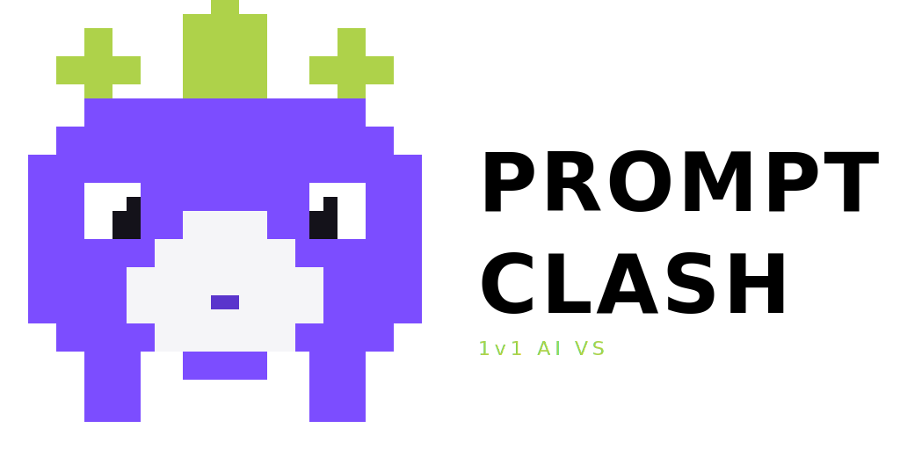
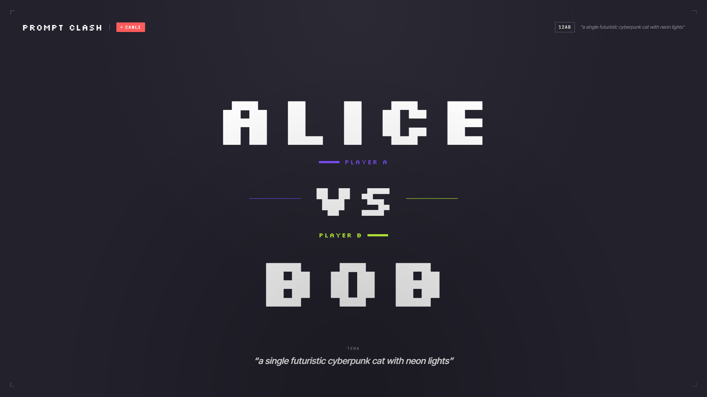
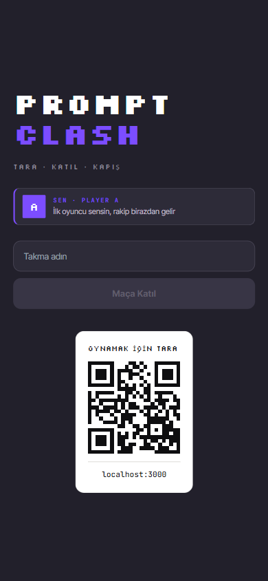
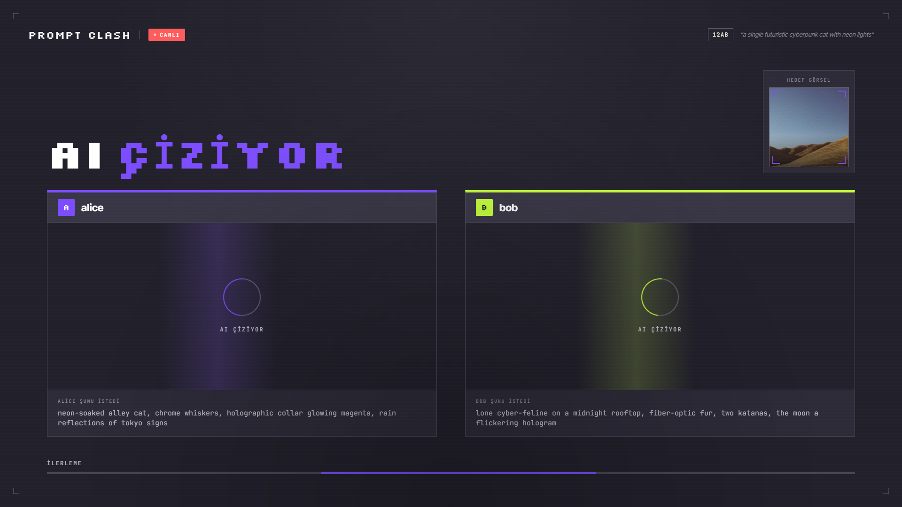
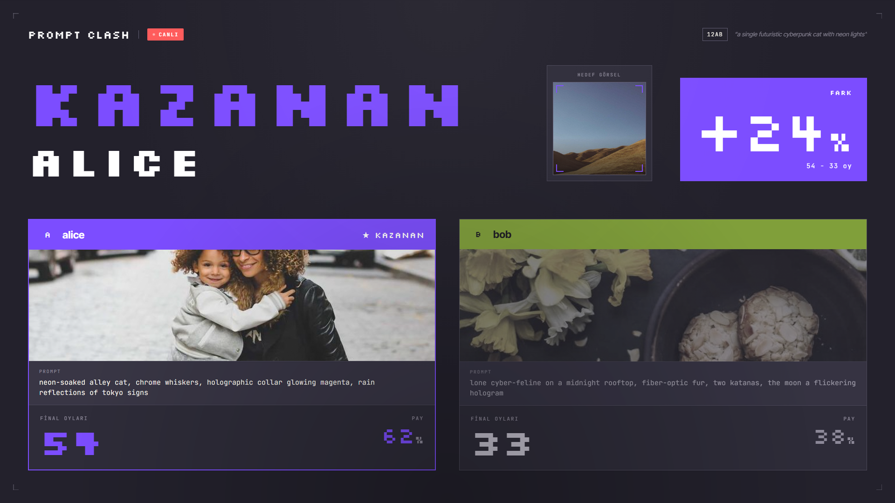

<p align="center">
  
</p>

# Prompt Clash

**Telefonunla katıl, prompt yaz, AI'a çizdir, kazanan sen ol.**

Etkinlikler için tasarlanmış, QR ile katılımlı **1v1 AI görsel üretme yarışması**. İki oyuncu aynı temayı alır, en iyi prompt'u yazmaya çalışır, AI görselleri üretir ve kazanan AI skoruyla belli olur. Hepsi büyük ekranda canlı akar.

<p align="center">
  
</p>

---

## 🎮 Nasıl çalışıyor?

Üç ekran var: **telefon** (oyuncu + izleyici), **sahne** (TV/projeksiyon) ve **admin**.

| 1. Katıl | 2. Üret | 3. Sonuç |
|:---:|:---:|:---:|
|  |  |  |
| QR'ı tara, takma adını gir, maça gir. | 60 saniyede prompt yaz — AI ikisini de çizer. | Gemini vision karşılaştırır, kazananı seçer. |

**Akış:** `VS` → 60sn prompt → AI görsel üretimi → Gemini vision skoru → kazanan → tekrar başa.

---

## ⚡ Hızlı başlangıç

```bash
# 1. Bağımlılıklar
npm install

# 2. .env oluştur (en az şunlar gerek)
cat > .env <<'EOF'
IMAGE_PROVIDER=cloudflare
CLOUDFLARE_ACCOUNT_ID=...
CLOUDFLARE_API_TOKEN=...
GEMINI_API_KEY=...
GEMINI_API_KEY_2=...        # opsiyonel — quota için key rotation
GEMINI_API_KEY_3=...        # opsiyonel
ADMIN_PASSWORD=admin123
ADMIN_COOKIE_SECRET=...     # openssl rand -hex 32
EOF

# 3. Çalıştır
npm run dev
```

Sonra:

| Adres | Ne için |
|---|---|
| `localhost:3000` | 📱 Telefon — katıl / izle |
| `localhost:3000/stage` | 📺 Sahne — TV / projeksiyon |
| `localhost:3000/admin` | 🛠️ Admin — ayarlar & kontrol |

**Minimum:** Node.js 20+, bir [Gemini API key](https://aistudio.google.com) (skor için), bir [Cloudflare Workers AI](https://dash.cloudflare.com/) hesabı (görsel için, ücretsiz tier yeterli).

**Opsiyonel:** MongoDB (maç geçmişi için — yoksa app çalışmaya devam eder, sadece persist etmez).

---

## 🧱 Mimari

- **Tek Node.js süreci** — Next.js (App Router) + Socket.io aynı portta (`server.js`)
- **Tek global maç** — oda yok, durum RAM'de singleton olarak tutulur, tek instance varsayımı
- **Provider switcher'lar** env ile seçilir:
  - `IMAGE_PROVIDER` = `cloudflare` | `pollinations` | `gemini`
  - `STORAGE_PROVIDER` = `local` (default, `public/uploads/`) | `gcs`
- **MongoDB opsiyonel** — varsa ayarlar/maç geçmişi/oy denetimi için kullanılır, yoksa app graceful degrade eder

### Gemini quota yönetimi

Gemini free tier 20 req/gün/key. Senaryo başına ~5 çağrı (target expansion ×2, translate ×2, vision scoring ×1) olduğu için tek key dar gelir.

- **Key rotation** — `GEMINI_API_KEY`, `GEMINI_API_KEY_2`, `GEMINI_API_KEY_3`... her çağrı round-robin döner, 429 alınca otomatik sıradaki key'e geçer
- **Expansion cache** — target prompt expansion'ları `cache/target-expansions.json`'a yazılır; ~80 deterministik kombinasyon ısındıktan sonra bu çağrılar quota harcamaz
- **EN sniff** — oyuncu zaten İngilizce yazdıysa `translateToEnglish` Gemini'ye gitmez, direkt geçer

---

## ☁️ Cloud Run'a deploy

Tek instance, session affinity ve CPU throttling kapalı (canlı socket için şart):

```bash
gcloud run deploy prompt-clash \
  --source . \
  --region europe-west1 --platform managed --allow-unauthenticated \
  --min-instances=1 --max-instances=1 \
  --session-affinity --cpu-throttling=disabled \
  --port=3000 --memory=512Mi \
  --set-env-vars IMAGE_PROVIDER=cloudflare \
  --set-secrets \
GEMINI_API_KEY=gemini-key-1:latest,\
GEMINI_API_KEY_2=gemini-key-2:latest,\
GEMINI_API_KEY_3=gemini-key-3:latest,\
CLOUDFLARE_ACCOUNT_ID=cf-account:latest,\
CLOUDFLARE_API_TOKEN=cf-token:latest,\
ADMIN_PASSWORD=admin-password:latest,\
ADMIN_COOKIE_SECRET=admin-cookie-secret:latest
```

Veya web console üzerinden `Cloud Run → Deploy from repository`. Dockerfile otomatik tespit edilir.

⚠️ **Maliyet uyarısı:** `min-instances=1` + CPU throttling kapalı = always-on. Free tier'ı aşar (~$15-30/ay tahminen). `$300` trial credit ile uzun süre bedava ama trial sonrası fatura kesilir. Etkinlik sonrası `Delete service` ile durdurabilirsin.

### Diğer deploy seçenekleri

Aynı Dockerfile şu platformlarda da çalışır:

| Platform | Aylık | Notum |
|---|---|---|
| **Koyeb** | $0 | Free tier hala var, sockets çalışır |
| **Fly.io** | $1.94+ | Free tier kalktı, $5 trial credit |
| **Railway** | ~$5-10 | En kolay GitHub deploy UX |
| **Render** paid | $7 | Stabil, sleep yok |
| **Hetzner VPS** | €4.51 | Tam kontrol, kendi setup |

---

## 🛠️ Komutlar

| Komut | Açıklama |
|---|---|
| `npm run dev` | Lokal geliştirme (`server.js` Next + Socket.io) |
| `npm run build` | Production build |
| `npm start` | Production sunucu |
| `npm run typecheck` | TypeScript kontrolü |
| `npm run lint` | Next lint |
| `node scripts/matchSmoke.js` | 2 fake oyuncu ile end-to-end smoke (server ayakta olmalı) |

### Dev-time preview (socket olmadan)

UI fixtures üstünden hızlı UI inceleme:

```
/preview/stage?phase=IDLE|VS_INTRO|PROMPTING|GENERATING|SCORING|VOTING|RESULT
/preview/phone?phase=...&slot=A|B
/demo                                     # tüm fazlar otomatik döner
```

---

## 🧰 Tech stack

`Next.js 14` · `React 18` · `Socket.io` · `Tailwind CSS` · `Framer Motion` · `MongoDB / Mongoose (opsiyonel)` · `Cloudflare Workers AI (görsel)` · `Google Gemini (skor + prompt expansion)`
